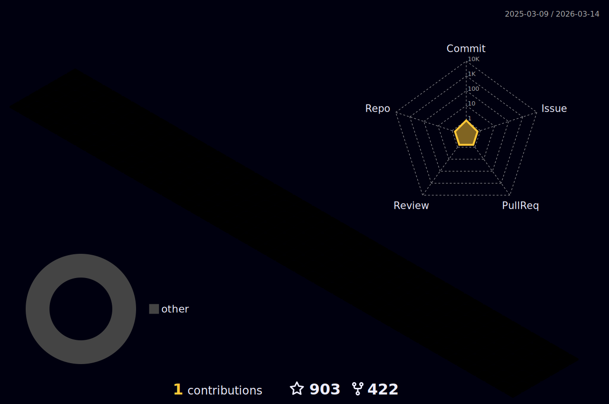

<h2 height="200px" align="center">𝗛𝗲𝗹𝗹𝗼 𝗜'𝗺 Lin Jiayu </h2>
<h2 align="center">A learning backend developer</h3>

# 个人介绍：

- <a href="https://blog.csdn.net/coding_lin?type=blog">myBlog</a>
- 努力的后端开发者

# Github status

